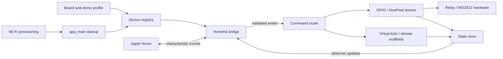

# ESP32 HomeKit Bridge

[](https://github.com/fanguoc2len/esp32-homekit-bridge/actions/workflows/esp-idf-build.yml)

Native Apple Home firmware for the smart-home platform migration. This repository
extracts the ESP32 HomeKit work from the original Flask/Firebase/Arduino stack
and organizes it as a standalone ESP-IDF project with clear device boundaries,
repeatable demo presets, and hardware-free smoke validation.

## Highlights

- ESP-IDF 5.5.x firmware with Espressif ESP HomeKit SDK integration
- Apple Home bridge with bridged accessories for light, switch, outlet, fan,
  lock, temperature, and humidity paths
- GPIO relay output driver plus WS2812/NeoPixel RGB driver
- Native HomeKit brightness, hue, saturation, fan rotation speed, and lock state
- Virtual lock and climate sensor scaffolds for hardware-independent system demos
- Wi-Fi onboarding through Espressif Unified Provisioning, with hardcoded
  credentials kept only as a bench-test option
- GitHub Actions workflow for LED, fan, and NeoPixel preset builds

## Architecture



The app core is intentionally independent from HomeKit-specific callbacks. The
bridge translates HomeKit writes into device states, the router applies those
states to hardware or virtual scaffolds, and the state store notifies HomeKit
when firmware-side changes happen.

See [docs/ARCHITECTURE.md](docs/ARCHITECTURE.md) for the module map.

## Device Coverage

| Path | HomeKit service | Backing implementation |
| --- | --- | --- |
| LED / relay | Lightbulb, Switch, Outlet | GPIO output driver |
| NeoPixel RGB | Lightbulb | WS2812 driver with brightness, hue, saturation |
| Rainbow effect | Switch | Virtual switch linked to the RGB light |
| Fan | Fan | GPIO relay scaffold with `RotationSpeed` semantics |
| Door lock | Lock Mechanism | Virtual lock state scaffold |
| Room climate | Temperature Sensor, Humidity Sensor | Virtual sensor with simulator updates |

## Build Prerequisites

1. Install ESP-IDF 5.5.x for ESP32.
2. Clone Espressif ESP HomeKit SDK.
3. Export both paths before building:

```bash
export IDF_PATH=/path/to/esp-idf
export ESP_HOMEKIT_SDK_PATH=/path/to/esp-homekit-sdk
```

CI pins the HomeKit SDK to commit `676fabac4a4a05184be020611cb069faa0016411`
so rebuilds do not silently change when the upstream default branch moves.

This repo includes `idf.sh` for the local WSL setup used during development.
On another machine you can run `idf.py` directly after exporting ESP-IDF.

## Build Presets

Default LED demo:

```bash
./idf.sh set-target esp32
./idf.sh build
```

NeoPixel RGB demo:

```bash
SDKCONFIG_DEFAULTS="sdkconfig.defaults;sdkconfig.led_demo.defaults;sdkconfig.neopixel_demo.defaults" \
  ./idf.sh -B build-neopixel -DSDKCONFIG=/tmp/doan2-neopixel.sdkconfig set-target esp32
SDKCONFIG_DEFAULTS="sdkconfig.defaults;sdkconfig.led_demo.defaults;sdkconfig.neopixel_demo.defaults" \
  ./idf.sh -B build-neopixel -DSDKCONFIG=/tmp/doan2-neopixel.sdkconfig build
```

Fan demo:

```bash
SDKCONFIG_DEFAULTS="sdkconfig.defaults;sdkconfig.fan_demo.defaults" \
  ./idf.sh -B build-fan -DSDKCONFIG=/tmp/doan2-fan.sdkconfig set-target esp32
SDKCONFIG_DEFAULTS="sdkconfig.defaults;sdkconfig.fan_demo.defaults" \
  ./idf.sh -B build-fan -DSDKCONFIG=/tmp/doan2-fan.sdkconfig build
```

Flash when hardware is available:

```bash
./idf.sh -p /dev/ttyUSB0 flash monitor
```

## Verification

Without hardware:

```bash
python3 scripts/check_no_secrets.py
./idf.sh build
SDKCONFIG_DEFAULTS="sdkconfig.defaults;sdkconfig.fan_demo.defaults" \
  ./idf.sh -B build-fan -DSDKCONFIG=/tmp/doan2-fan.sdkconfig set-target esp32
SDKCONFIG_DEFAULTS="sdkconfig.defaults;sdkconfig.fan_demo.defaults" \
  ./idf.sh -B build-fan -DSDKCONFIG=/tmp/doan2-fan.sdkconfig build
SDKCONFIG_DEFAULTS="sdkconfig.defaults;sdkconfig.led_demo.defaults;sdkconfig.neopixel_demo.defaults" \
  ./idf.sh -B build-neopixel -DSDKCONFIG=/tmp/doan2-neopixel.sdkconfig set-target esp32
SDKCONFIG_DEFAULTS="sdkconfig.defaults;sdkconfig.led_demo.defaults;sdkconfig.neopixel_demo.defaults" \
  ./idf.sh -B build-neopixel -DSDKCONFIG=/tmp/doan2-neopixel.sdkconfig build
```

With hardware, pair through Apple Home after Wi-Fi provisioning and validate the
accessories listed in [docs/TESTING.md](docs/TESTING.md).

## Security Notes

- `sdkconfig` is intentionally ignored because it can contain local Wi-Fi
  credentials and per-machine build settings.
- Shared defaults live in `sdkconfig.defaults` and demo preset files.
- The default HomeKit setup code is for development only. Change it before any
  real deployment.

## Documentation

- [PAIRING.md](PAIRING.md): first-boot provisioning and Apple Home pairing
- [LED_DEMO.md](LED_DEMO.md): simple GPIO/LED smoke path
- [NEOPIXEL_DEMO.md](NEOPIXEL_DEMO.md): RGB light and rainbow effect path
- [FAN_DEMO.md](FAN_DEMO.md): fan relay and rotation speed path
- [MIGRATION_MAP.md](MIGRATION_MAP.md): old DoAn2 feature to HomeKit mapping
- [ROADMAP.md](ROADMAP.md): remaining hardware validation work
